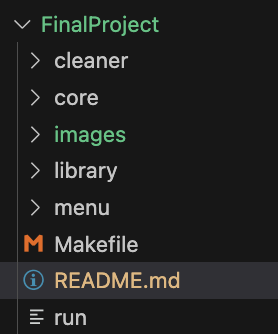
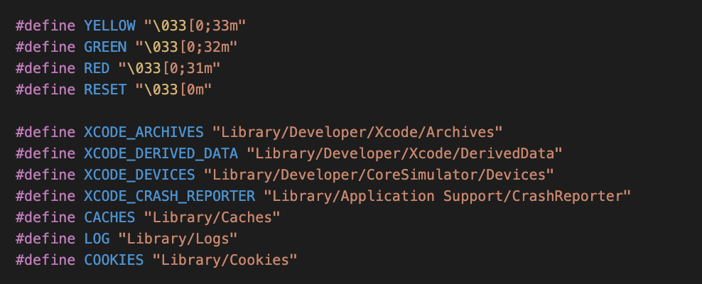
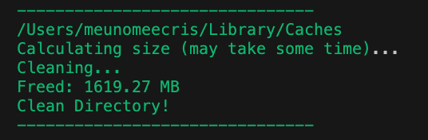
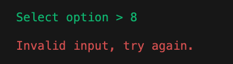

# Mac Cleanup for iOS Developer in C
#### Video Demo: https://youtu.be/ZOA7sej3EOc
#### Description:

##Mac Cleanup##
It is a program created for iOS developers who use Xcode. As we know, Xcode uses a lot of space, and sometimes your Mac may show low space warnings or even crash. Cleaning Xcode folders manually, like caches, logs, cookies, crash reports, DerivedData, or Archives, can take time.

This program automates the cleanup process, making it faster, easier, and safer. It was initially created for personal use, but I decided to make it user-friendly with clear messages and error handling.

- Written in C, using knowledge from the CS50 course and internet resources.
- Confirmation before deletion: The program asks the user for confirmation before deleting any files, ensuring no accidental loss of important data.
- Makefile: Compiles the code and runs the program efficiently.
- Code organization: Functions are separated into different files to improve readability, maintainability, and modularity.

    
- Library used:
    `cs50.h` – for easy input of characters and strings.
    `unistd.h` – to use `sleep()` and make the program dynamic, and others.

## Features
1. User-friendly MENU interface with color output and clear messages.

    
2. Folder scanning for important Xcode directories: Caches, Logs, Cookies, CrashReporter, DerivedData, and Archives.
 
    
3. Space display: shows the amount of space cleared.
 
    
4. Confirmation request: asks the user before cleaning any folder.
 
    

## Project Roadmap
- Project fundamentals and command-line menu
- Directory scanning and size calculation
- Cleanup process
- Mapping all targets and integrating the menu
- Final refinement, testing, and verification

## Program Flow
* main.c: the starting point. Calls `menu_cli()` (for user input) and passes the choice to `read_and_clean()` to perform cleanup.
* menu_cli.c: handles the user interface: displays messages, gets input, and validates it.
* core.c: performs system tasks: builds paths, calculates folder sizes, and deletes files.

I have all the courses documented on my GitHub.
https://github.com/meunomeecris/Harvard-CS50
> Note: these solutions are shared for educational and demonstration purposes only.